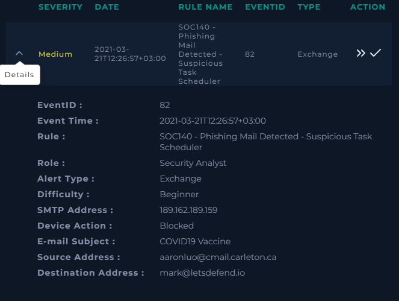
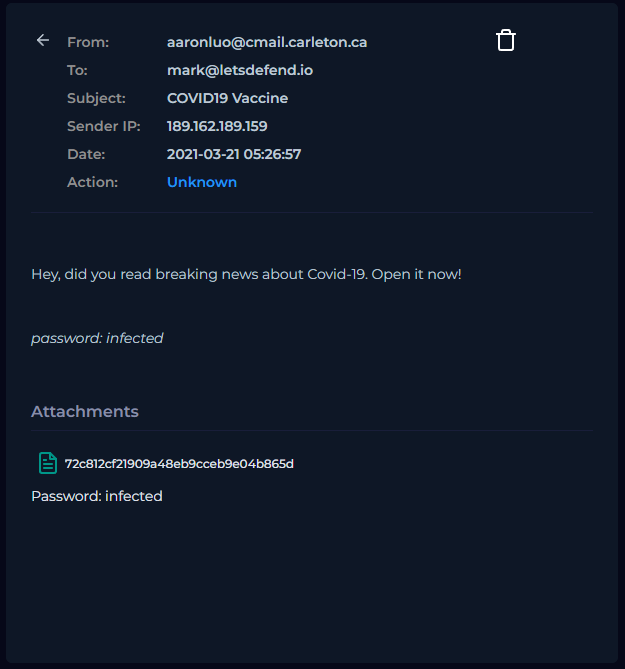
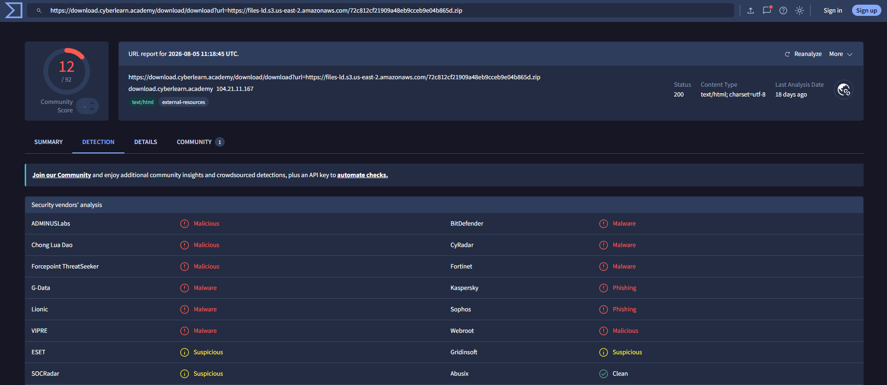
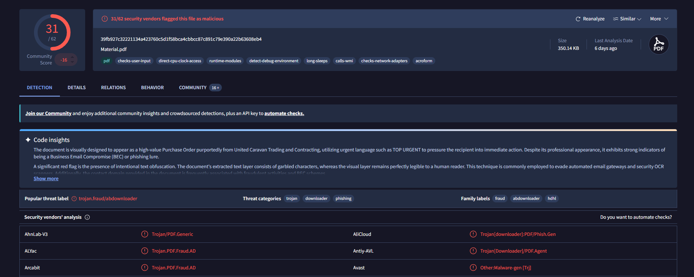
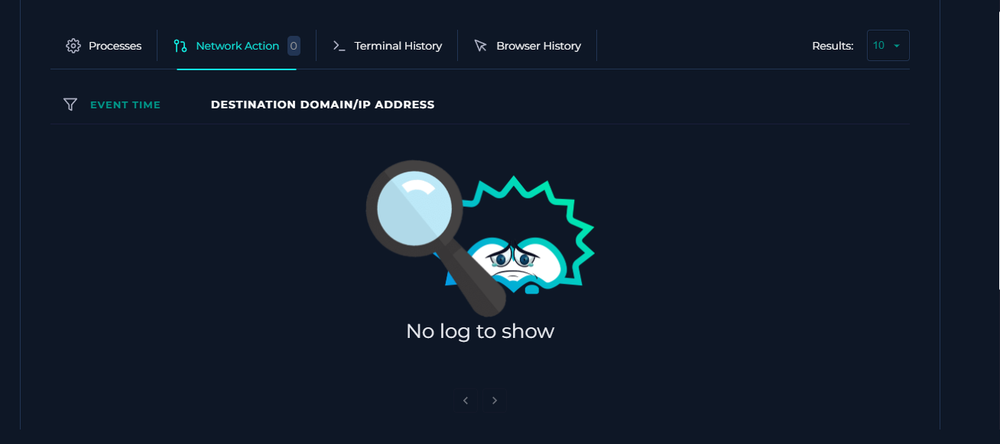
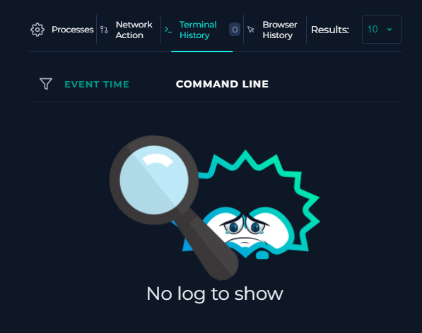

# SOC140 - Phishing Mail Detected - Suspicious Task Scheduler 
 
## Executive Summary 
 
I investigated a medium-severity phishing alert in the Let’sDefend simulated SOC environment involving an email with the subject **"COVID19 Vaccine."** 
 
The investigation included email analysis, malicious URL and file reputation analysis, and review of endpoint network and terminal telemetry. 
 
The email contained a malicious attachment and associated download URL. VirusTotal identified both the download URL and the PDF file as malicious. However, the email security control blocked the message before it was delivered to the recipient. 
 
Review of endpoint telemetry found no related network or terminal activity indicating successful execution or compromise. 
 
The alert was classified as a **True Positive — Prevented**, because the phishing attempt contained malicious content but was successfully blocked before reaching the user. 
 
--- 
 
## Alert Details 
 
| Field | Value | 
|---|---| 
| Alert | SOC140 - Phishing Mail Detected - Suspicious Task Scheduler | 
| Severity | Medium | 
| Event ID | 82 | 
| Event Time | 2021-03-21 12:26:57 +03:00 | 
| Alert Type | Exchange | 
| Difficulty | Beginner | 
| SMTP Address | `189.162.189.159` | 
| Device Action | Blocked | 
| Email Subject | `COVID19 Vaccine` | 
| Sender | `aaronluo@cmail.carleton.ca` | 
| Recipient | `mark@letsdefend.io` | 
 
 
 
--- 
 
## Email Analysis 
 
The email was sent from: 
 
`aaronluo@cmail.carleton.ca` 
 
to: 
 
`mark@letsdefend.io` 
 
with the subject: 
 
`COVID19 Vaccine` 
 
The sender IP was: 
 
`189.162.189.159` 
 
The message attempted to create urgency by encouraging the recipient to open information about breaking COVID-19 news. 
 
A password-protected attachment was included with the email. 
 
 
 
--- 
 
## URL Analysis 
 
The download URL associated with the attachment was analyzed using VirusTotal. 
 
VirusTotal showed **12 of 92 security vendors** flagging the URL with classifications including malicious, malware, phishing, and suspicious. 
 
 
 
--- 
 
## File Analysis 
 
The PDF file `Material.pdf` was also analyzed using VirusTotal. 
 
VirusTotal showed **31 of 62 security vendors** flagging the file as malicious. 
 
The report included threat categories such as: 
 
- Trojan 
- Downloader 
- Phishing 
 
The file's SHA-256 hash was: 
 
`39fb927c32221134a423760c5d1f58bca4cbbcc87c891c79e390a22b63608eb4` 
 
 
 
--- 
 
## Delivery Analysis 
 
The initial alert showed the device action as: 
 
**Blocked** 
 
The Let’sDefend playbook confirmed that the email was **not delivered** to the recipient. 
 
This was an important part of the investigation because identifying malicious content does not automatically mean the endpoint was compromised. 
 
--- 
 
## Endpoint Investigation 
 
After confirming that the email and attachment were malicious, I reviewed available endpoint telemetry for evidence of successful execution or follow-on activity. 
 
### Network Activity 
 
No related network activity was recorded on the endpoint. 
 
 
 
### Terminal Activity 
 
No related terminal commands were recorded on the endpoint. 
 
 
 
I also reviewed the available process and browser activity during the investigation and found no evidence tying suspicious execution or scheduled-task activity to this alert. 
 
--- 
 
## Investigation Timeline 
 
| Stage | Finding | 
|---|---| 
| Email triage | Suspicious phishing email identified | 
| URL analysis | Download URL flagged as malicious | 
| File analysis | `Material.pdf` flagged by 31/62 vendors | 
| Delivery analysis | Email blocked and not delivered | 
| Endpoint review | No related network activity identified | 
| Terminal review | No related terminal activity identified | 
| Compromise assessment | No evidence of successful execution or compromise | 
| Final classification | True Positive — Prevented | 
 
--- 
 
## Indicators and Artifacts 
 
| Type | Value | Context | 
|---|---|---| 
| Email Domain | `cmail.carleton.ca` | Phishing sender domain | 
| Email Sender | `aaronluo@cmail.carleton.ca` | Phishing sender address | 
| SMTP IP | `189.162.189.159` | Phishing SMTP source IP | 
| MD5 Hash | `72c812cf21909a48eb9ccbe9e04b865d` | Malicious attachment hash | 
| SHA-256 | `39fb927c32221134a423760c5d1f58bca4cbbcc87c891c79e390a22b63608eb4` | `Material.pdf` file hash | 
| Download URL | `hxxps://files-ld[.]s3[.]us-east-2[.]amazonaws[.]com/72c812cf21909a48eb9ccbe9e04b865d[.]zip` | Malicious attachment download location | 
 
The URL has been defanged to prevent accidental access. 
 
--- 
 
## Verdict 
 
### True Positive — Prevented 
 
The alert was classified as a **True Positive** because the email contained malicious content and the associated URL and file were identified as malicious. 
 
However, the email security control successfully **blocked the message before delivery**. 
 
Endpoint review found no evidence of: 
 
- Successful attachment execution 
- Related network connections 
- Terminal commands 
- Browser activity associated with the attack 
- Scheduled-task persistence 
- Successful endpoint compromise 
 
This case demonstrates that a **True Positive does not necessarily mean a successful compromise**. A security control can correctly detect and prevent a real malicious attack before it reaches the user. 
 
--- 
 
## Response 
 
Because the malicious email was blocked before delivery and no evidence of endpoint compromise was identified, **no endpoint containment action was performed during the investigation**. 
 
The primary security control successfully prevented the phishing message from reaching the recipient. 
 
--- 
 
## Skills Demonstrated 
 
- Phishing email analysis 
- SOC alert triage 
- URL reputation analysis 
- Malicious file analysis 
- VirusTotal analysis 
- Email delivery validation 
- Endpoint telemetry review 
- Network activity analysis 
- Terminal activity analysis 
- IOC documentation 
- Incident classification 
- Compromise assessment 
 
--- 
 
## Key Takeaways 
 
This investigation reinforced the importance of separating **malicious intent** from **successful compromise**. 
 
Although the attachment and download URL were malicious, the email was blocked before reaching the recipient. Reviewing endpoint telemetry confirmed that there was no evidence of successful execution or follow-on activity. 
 
The investigation also demonstrated why analysts should validate both the threat itself and its actual impact before determining the scope of an incident. 
 
--- 
 
## Environment 
 
This investigation was performed in the **Let’sDefend simulated Security Operations Center environment**. 
 
## Disclaimer 
 
This case study documents a cybersecurity training investigation completed for portfolio development. It does not represent a production incident handled for an employer.
