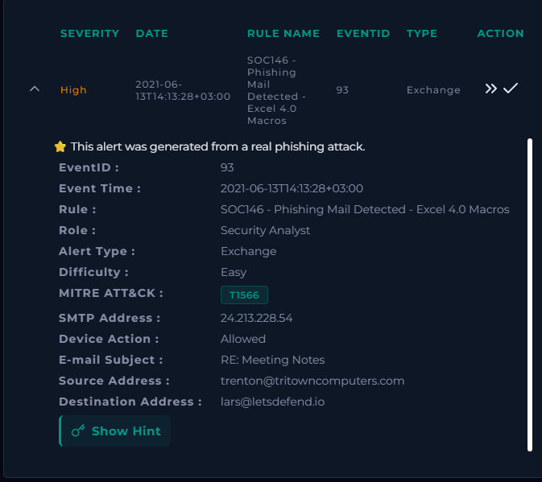
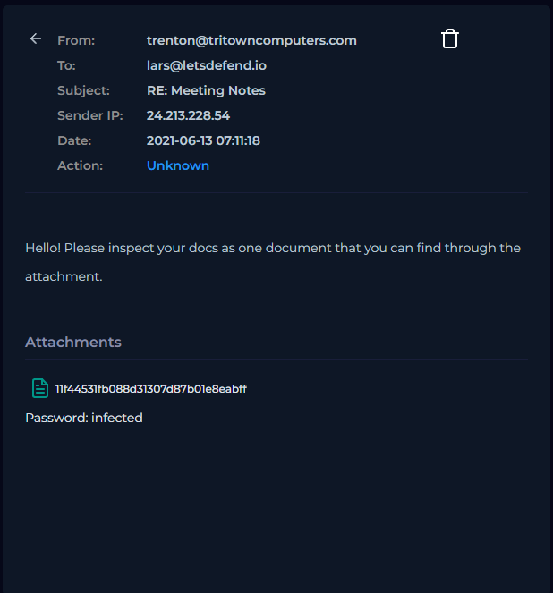
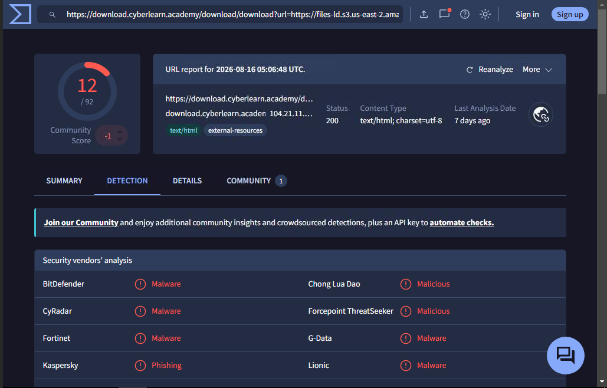
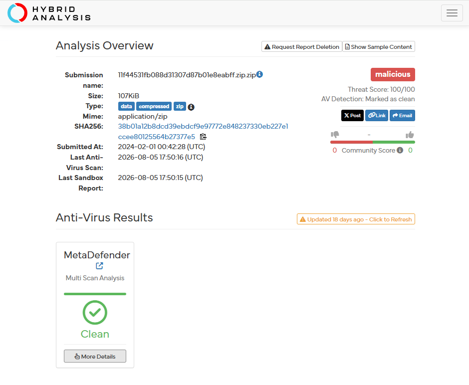
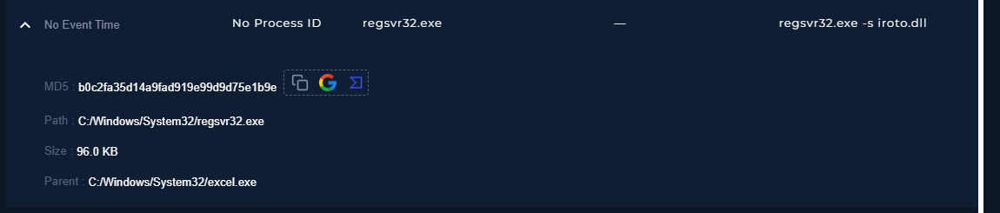
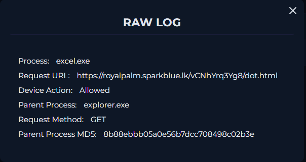
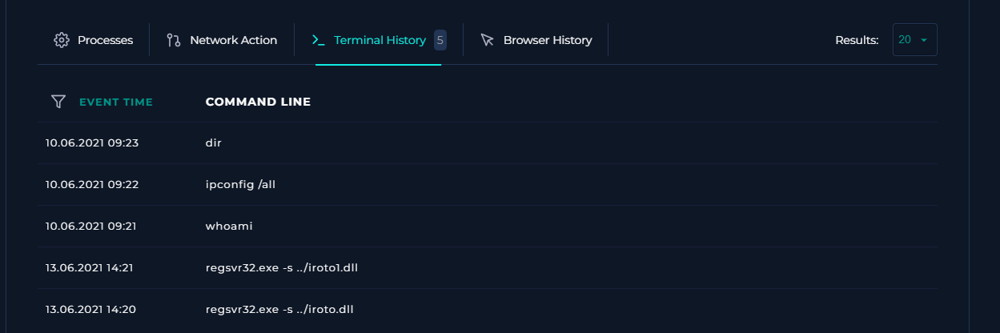
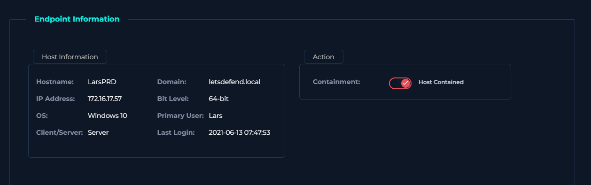

# SOC146 - Phishing Mail Detected - Excel 4.0 Macros

## Executive Summary

I investigated a high-severity phishing alert in the Let’sDefend simulated SOC environment involving a malicious email delivered to a user with the subject **"RE: Meeting Notes."**

The investigation included email analysis, URL and attachment reputation analysis, endpoint telemetry, process activity, and network activity.

Endpoint evidence showed Microsoft Excel spawning the legitimate Windows utility `regsvr32.exe`, which executed a DLL using the command:

`regsvr32.exe -s irotod.dll`

Additional telemetry showed `excel.exe` making an outbound web request to suspicious infrastructure.

Based on the correlated email, endpoint, process, and network evidence, the incident was classified as a **True Positive**. The malicious email was deleted from the recipient's mailbox and the affected endpoint was contained through the simulated EDR platform.

## Alert Details

| Field | Value |
|---|---|
| Alert | SOC146 - Phishing Mail Detected - Excel 4.0 Macros |
| Severity | High |
| Event ID | 93 |
| Event Time | 2021-06-13 14:13:28 +03:00 |
| Alert Type | Exchange |
| Difficulty | Easy |
| MITRE ATT&CK | T1566 - Phishing |
| SMTP Address | `24.213.228.54` |
| Device Action | Allowed |
| Email Subject | `RE: Meeting Notes` |
| Sender | `trenton@tritowncomputers.com` |
| Recipient | `lars@letsdefend.io` |

---

## Email Analysis

The email was sent from:

`trenton@tritowncomputers.com`

to:

`lars@letsdefend.io`

with the subject:

`RE: Meeting Notes`

The sender IP was:

`24.213.228.54`

The message instructed the recipient to inspect documents contained in an attachment. The email included a password-protected attachment.

---

## URL and Attachment Analysis

The download URL associated with the attachment was analyzed using VirusTotal.

VirusTotal showed **12 of 92 security vendors** flagging the URL, with detections including malicious, malware, and phishing classifications.

The downloaded ZIP archive was also submitted to Hybrid Analysis.

Hybrid Analysis classified the sample as:

- **Verdict:** Malicious
- **Threat Score:** 100/100
- **File Type:** ZIP archive
- **MIME Type:** `application/zip`

The report also showed that its antivirus scan marked the file as clean, while the sandbox analysis classified it as malicious. This reinforced the importance of correlating multiple analysis sources rather than relying on one reputation result.

---

## Endpoint Investigation

The affected endpoint was identified as:

| Field | Value |
|---|---|
| Hostname | `LarsPRD` |
| IP Address | `172.16.17.57` |
| Operating System | Windows 10 |
| Domain | `letsdefend.local` |
| Primary User | Lars |

Process telemetry revealed suspicious use of `regsvr32.exe`.

The process details showed:

- **Process:** `regsvr32.exe`
- **Path:** `C:\Windows\System32\regsvr32.exe`
- **Command:** `regsvr32.exe -s irotod.dll`
- **Parent Process:** `C:\Windows\System32\excel.exe`

This evidence showed Microsoft Excel launching `regsvr32.exe` after the suspicious document was opened.

---

## Network Analysis

Endpoint telemetry showed `excel.exe` making an outbound GET request to:

`hxxps://royalpalm[.]sparkblue[.]lk/vCNhYrq3Yg8/dot[.]html`

The URL has been defanged to prevent accidental access.

The device action for the connection was **Allowed**.

### Terminal History

Additional `regsvr32.exe` activity was observed at approximately the same time as the suspicious network activity:

- 14:20 - `regsvr32.exe -s ../iroto.dll`
- 14:21 - `regsvr32.exe -s ../iroto1.dll`

---

## Investigation Timeline

| Stage | Finding |
|---|---|
| Email triage | Suspicious email delivered to recipient |
| URL analysis | Download URL flagged by multiple security vendors |
| Sandbox analysis | ZIP archive classified as malicious |
| Endpoint analysis | Suspicious process execution identified |
| Process analysis | `excel.exe` identified as parent of `regsvr32.exe` |
| Network analysis | Outbound web request generated by `excel.exe` |
| Classification | True Positive |
| Email remediation | Malicious email deleted |
| Endpoint response | `LarsPRD` contained through EDR |

---

## Indicators and Artifacts

| Type | Value | Context |
|---|---|---|
| Email Sender | `trenton@tritowncomputers.com` | Phishing sender |
| Email Domain | `tritowncomputers.com` | Sender domain |
| SMTP IP | `24.213.228.54` | Email source |
| MD5 Hash | `11f44531fb088d31307d87b01e8eabff` | Attachment artifact recorded during investigation |
| URL | `hxxps://royalpalm[.]sparkblue[.]lk/vCNhYrq3Yg8/dot[.]html` | Outbound URL observed from `excel.exe` |
| Endpoint IP | `172.16.17.57` | Affected endpoint `LarsPRD` |

---

## MITRE ATT&CK

### T1566 - Phishing

The SOC146 alert was mapped to **T1566 - Phishing**, representing the delivery of malicious content through email.

The investigation also involved analysis of suspicious process execution involving a legitimate Windows utility. I limited the formal ATT&CK mapping to the technique directly identified by the alert rather than assigning additional techniques without sufficient evidence.

---

## Verdict

### True Positive

The incident was classified as a **True Positive** based on the following correlated findings:

- A suspicious email was delivered to the recipient.
- The email contained an attachment associated with malicious content.
- VirusTotal identified multiple malicious detections for the download URL.
- Hybrid Analysis classified the ZIP archive as malicious.
- Endpoint telemetry showed `excel.exe` spawning `regsvr32.exe`.
- `regsvr32.exe` was used to silently load/register a DLL.
- `excel.exe` generated suspicious outbound network activity.

---

## Response and Containment

### Email Remediation

The malicious email was deleted from the recipient's mailbox.

### Endpoint Containment

The affected endpoint `LarsPRD` was contained using the simulated EDR platform.

---

## Skills Demonstrated

- Phishing email analysis
- SOC alert triage
- URL reputation analysis
- Sandbox analysis
- Endpoint investigation
- Windows process analysis
- Parent-child process correlation
- Network telemetry analysis
- IOC documentation
- MITRE ATT&CK mapping
- Incident classification
- Email remediation
- Endpoint containment

---

## Key Takeaways

This investigation demonstrated the importance of correlating evidence across multiple data sources.

The strongest evidence came from connecting the phishing email to endpoint behavior and network activity. The process tree showed `excel.exe` spawning `regsvr32.exe`, providing evidence that opening the malicious document led to suspicious DLL execution.

The case also demonstrated why analysts should not rely on a single reputation or antivirus result when determining whether activity is malicious.

---

## Environment

This investigation was performed in the **Let’sDefend simulated Security Operations Center environment**.

## Disclaimer

This case study documents a cybersecurity training investigation completed for portfolio development. It does not represent a production incident handled for an employer.
